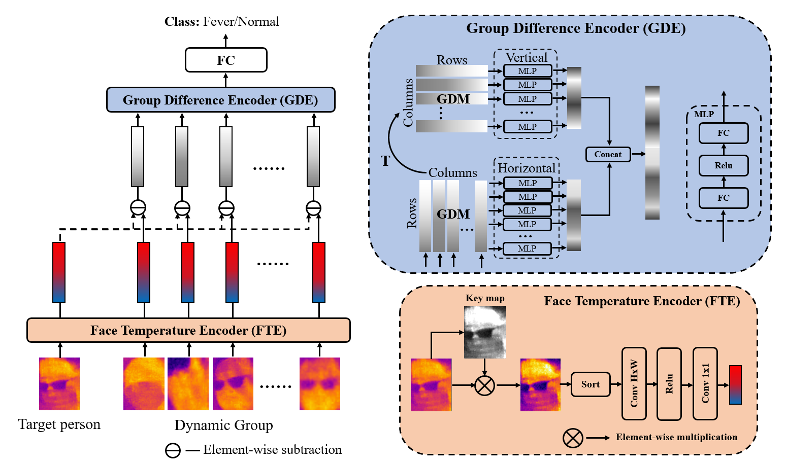

# Dynamic Group Difference Coding based on Thermal Infrared Face Image for Fever Screening

**Dataset Link:** http://ieee-dataport.org/documents/thermal-infrared-face-tif

**Tutorial:** Coming soon.

## Reference
@ARTICLE{10012353,
  author={Yan, Mengkai and Qian, Jianjun and Wang, Renke and Gao, Shangbing and Yang, Jian},
  journal={IEEE Transactions on Instrumentation and Measurement}, 
  title={Dynamic Group Difference Coding Based on Thermal Infrared Face Image for Fever Screening}, 
  year={2023},
  volume={72},
  number={},
  pages={1-13},
  doi={10.1109/TIM.2023.3235442}}
